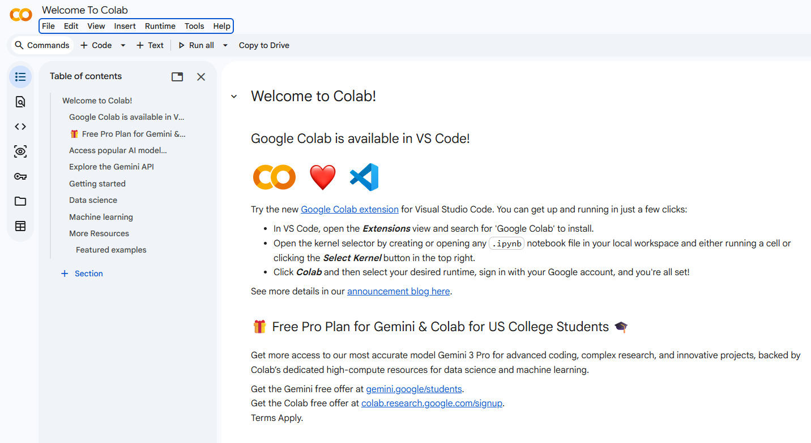
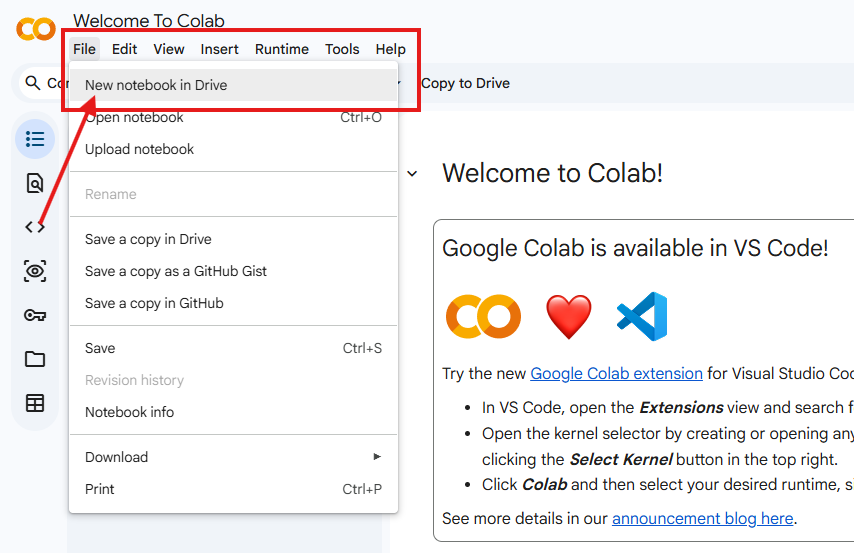
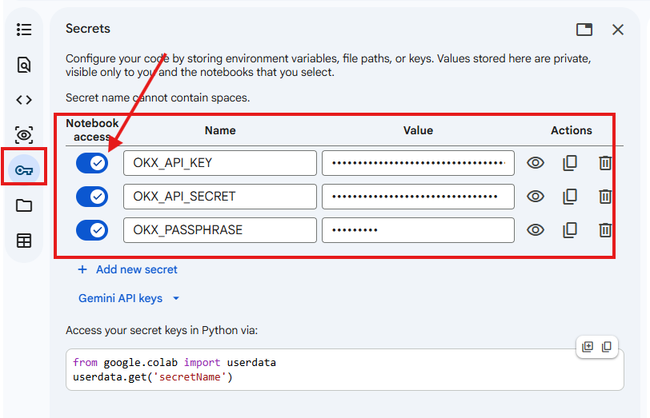
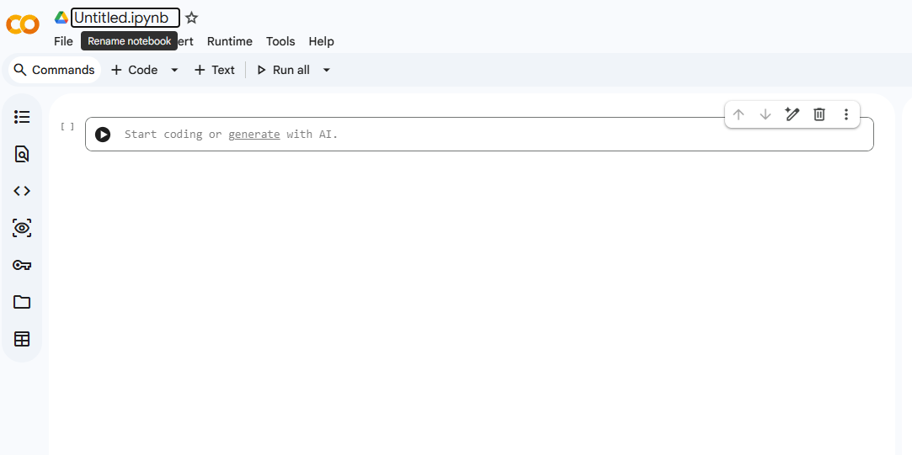
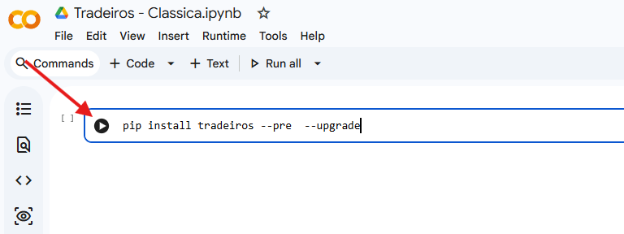
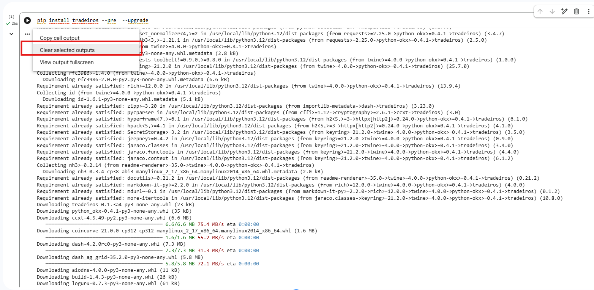
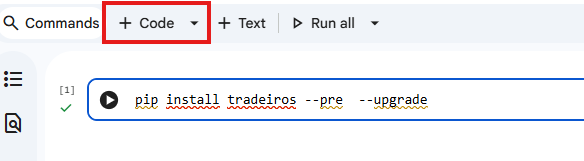
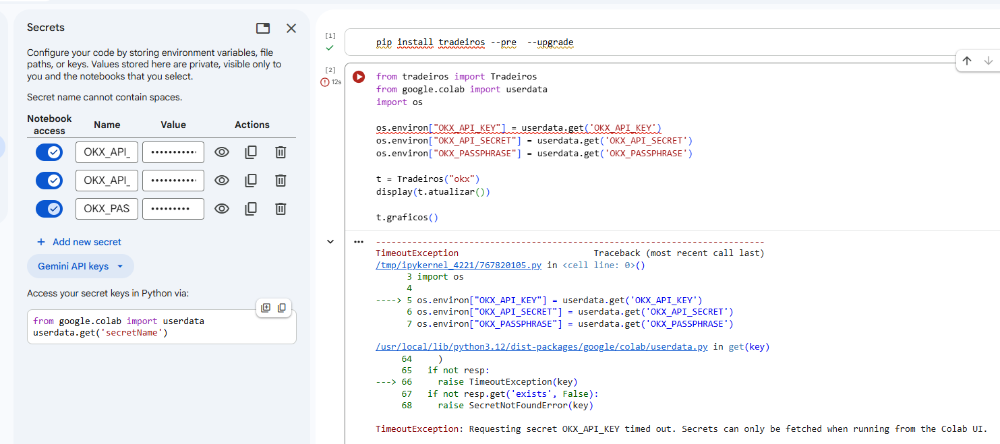
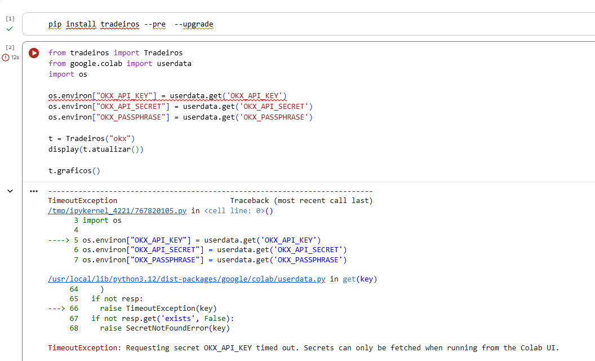
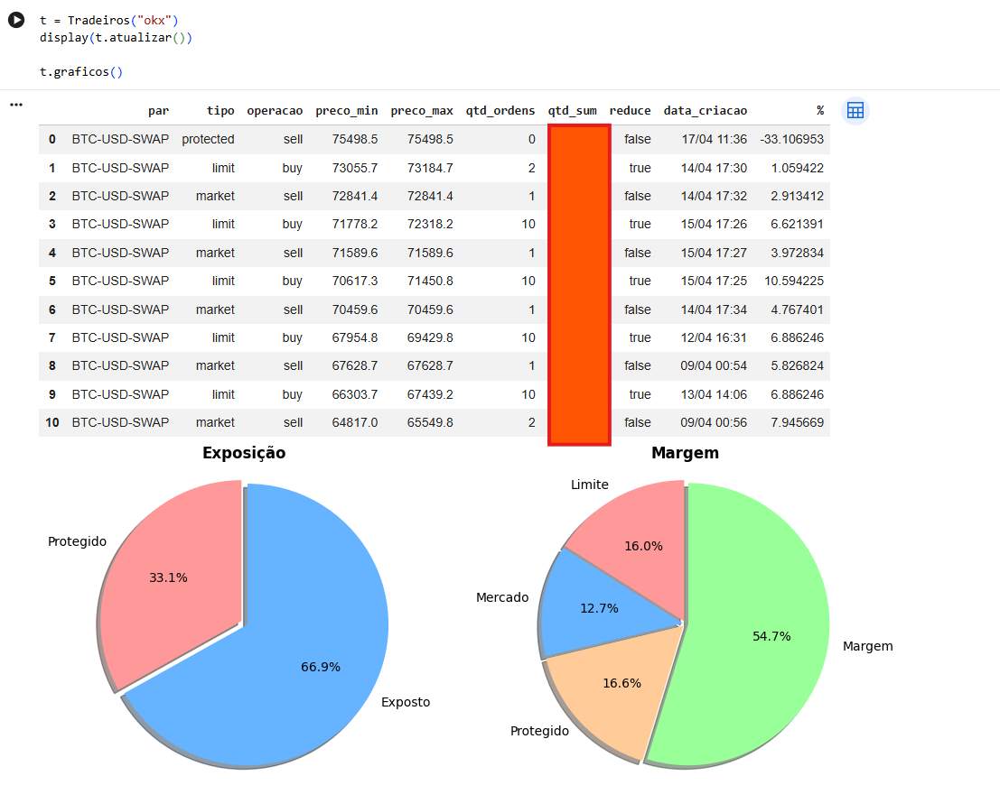

# Guia de Instalação e Configuração no Google Colab

Este guia detalha o passo a passo para configurar a biblioteca **Tradeiros** no Google Colab, utilizando o recurso de **Secrets** para proteger suas chaves de API.

> [!CAUTION]
> **AVISO DE SEGURANÇA:** Por motivos de segurança, recomendamos fortemente o uso de uma **API-KEY configurada como SOMENTE LEITURA (Read-Only)**. Nunca utilize chaves com permissão de saque (Withdraw) ou transferência em ferramentas de visualização.

> [!NOTE]
> **Exchanges Suportadas:** Atualmente, a biblioteca suporta a exchange **OKX**. O suporte para **Bitget** e **Bybit** está em desenvolvimento e será disponibilizado nos próximos releases.

---

### 1. Acessar o Google Colab
Abra o [Google Colab](https://colab.research.google.com/) e faça login com sua conta Google.



---

### 2. Criar um Novo Notebook
Vá em **File (Arquivo)** -> **New notebook (Novo notebook)** no Drive.



---

### 3. Configurar as Chaves de API (Secrets)
Clique no ícone de **Chave (Secrets)** na barra lateral esquerda. Adicione as seguintes chaves com os valores da sua conta:
- `OKX_API_KEY`
- `OKX_API_SECRET`
- `OKX_PASSPHRASE`



> [!IMPORTANT]
> Certifique-se de ativar a chave **Notebook access** para as três variáveis para que o código possa lê-las.

---

### 4. Renomear o Notebook
Clique no nome do arquivo no topo (ex: `Untitled.ipynb`) e renomeie para algo descritivo, como `Tradeiros - Minha Carteira`.



---

### 5. Instalar a Biblioteca
Copie e cole o comando abaixo em uma célula de código e execute para instalar a biblioteca:

```python
!pip install tradeiros --pre --upgrade
```



> [!TIP]
> A instalação só precisa ser feita na **primeira execução do dia** ou caso o Google Colab reinicie seu ambiente devido a um longo tempo de inatividade. Em execuções subsequentes no mesmo dia, você pode pular esta célula.

---

### 6. Limpar o Output (Opcional)
Após a instalação bem-sucedida, você pode clicar com o botão direito na célula e selecionar **Clear selected outputs** para manter o notebook limpo.



---

### 7. Adicionar Célula de Execução
Clique no botão **+ Code** para adicionar uma nova célula abaixo da instalação para inserir o código de visualização.



---

### 8. Código de Visualização
Copie o código abaixo para a nova célula. Ele utiliza o `userdata` do Colab para buscar suas chaves configuradas nos Secrets.

```python
from tradeiros import Tradeiros
from google.colab import userdata
import os

# Configura as variáveis de ambiente a partir dos Secrets do Colab
os.environ["OKX_API_KEY"] = userdata.get('OKX_API_KEY')
os.environ["OKX_API_SECRET"] = userdata.get('OKX_API_SECRET')
os.environ["OKX_PASSPHRASE"] = userdata.get('OKX_PASSPHRASE')

# Inicializa e exibe os dados
t = Tradeiros("okx")
display(t.atualizar())
t.graficos()
```



> [!CAUTION]
> **Erro de Importação:** Se você receber a mensagem `ModuleNotFoundError: No module named 'tradeiros'`, certifique-se de que executou a célula do **Passo 5** corretamente.

> [!TIP]
> Se você esquecer de habilitar o acesso no passo 3, o Colab exibirá um erro de **Timeout** conforme mostrado abaixo:
> 

---

### 9. Visualizar Resultados
Execute a célula e você verá a tabela dinâmica de ordens consolidada e os gráficos de **Exposição** e **Margem**.



---
